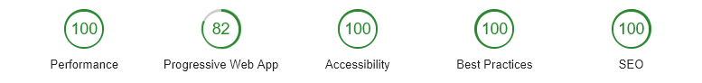

# Portfolio

A simple and minimal portfolio, Using Material UI with React.

Google Lighthouse Scores: 100 performance, 100 Accessibility, 100 Best Practices: 78 SEO.

Loads in around 150ms for the first paint.



---

Setup locally:

```
npm install
```

```
npm start
```

---

To run a lighthouse audit:

```
Open chrome dev tools
```

```
Click on audits
```

```
Change the settings as you see fit. Click on Perform an audit.
```

The scores in the screenshot are using Desktop emulation with 3g W/ CPU Slowdown.

---

##### [Material UI as the front-end framework](https://material-ui.com/)

##### [Chartist.js for the github commits chart](https://gionkunz.github.io/chartist-js/)
